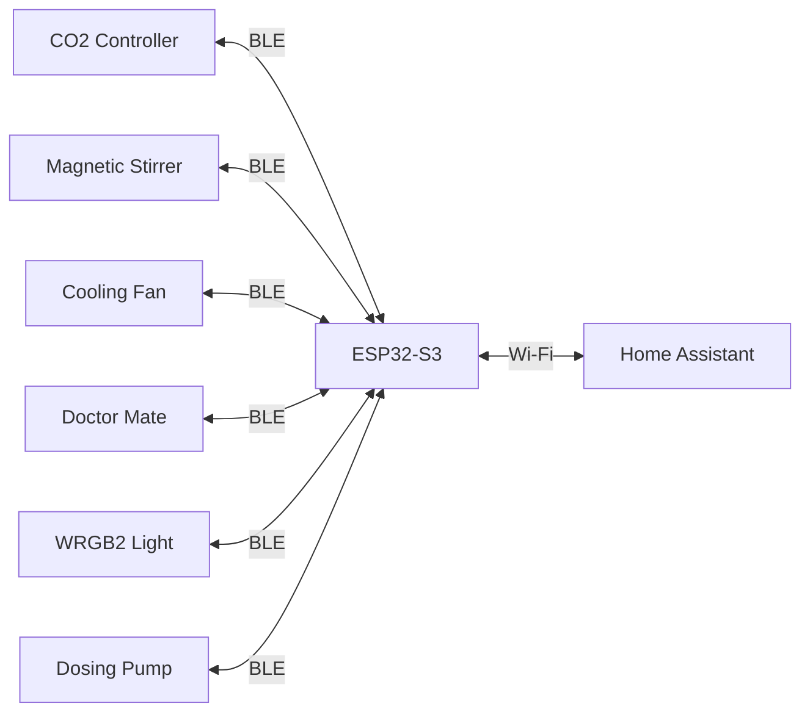
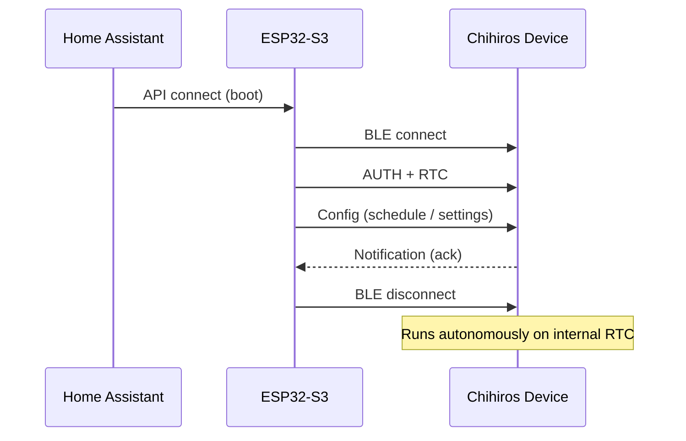
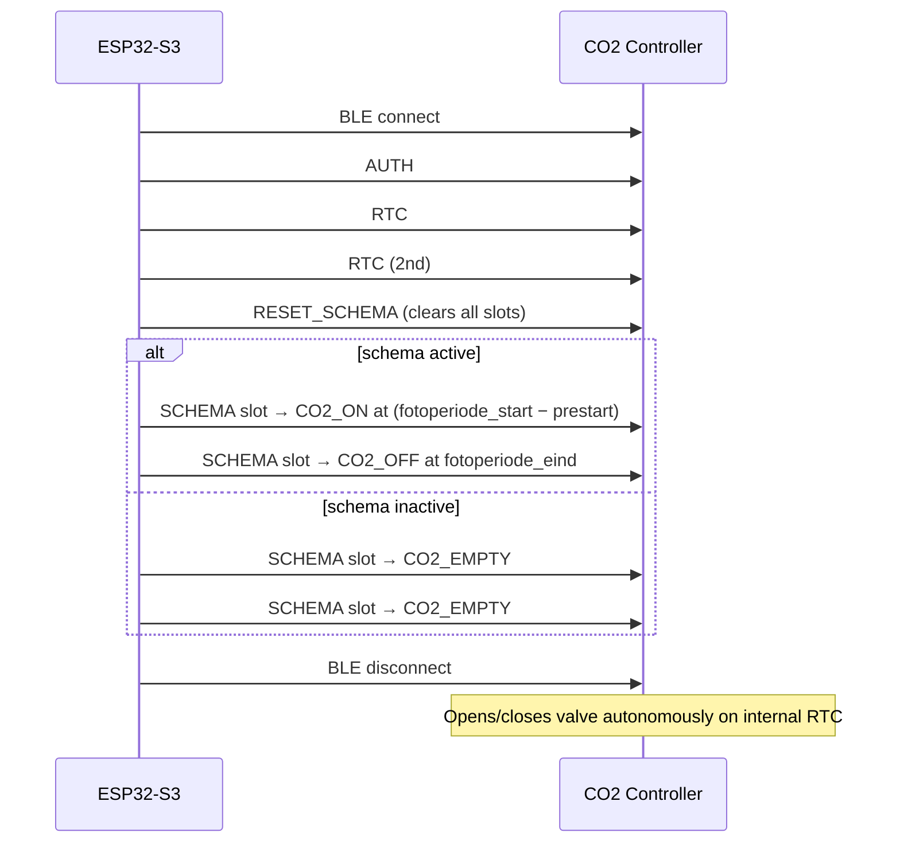
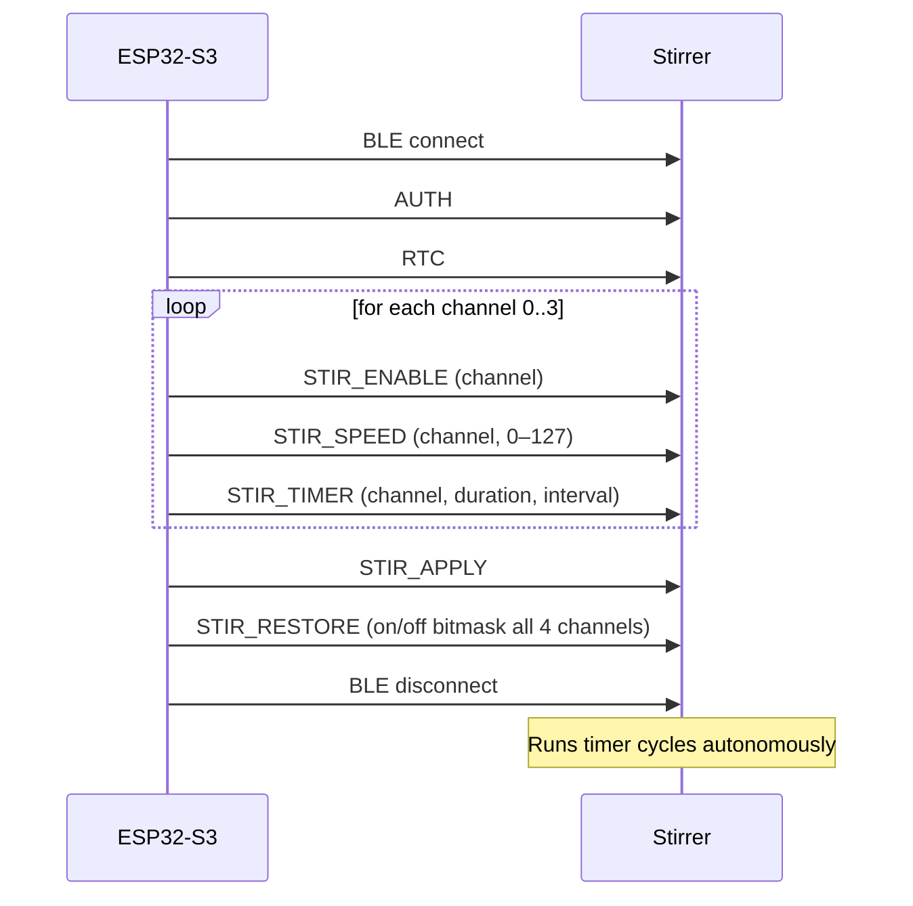
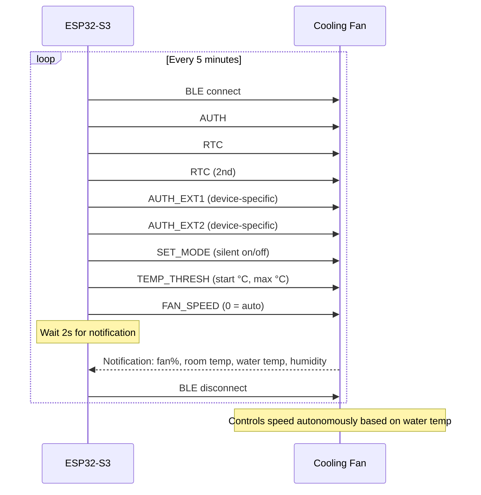
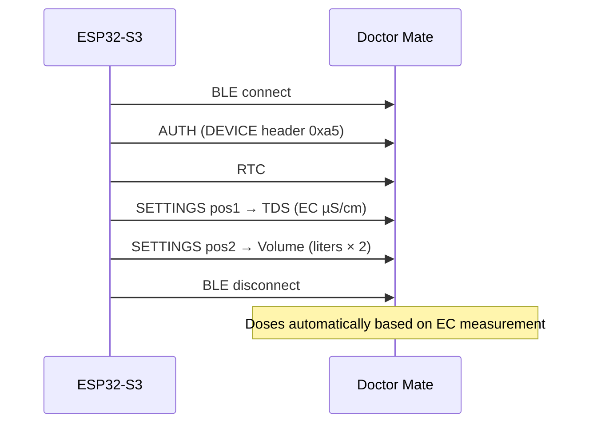
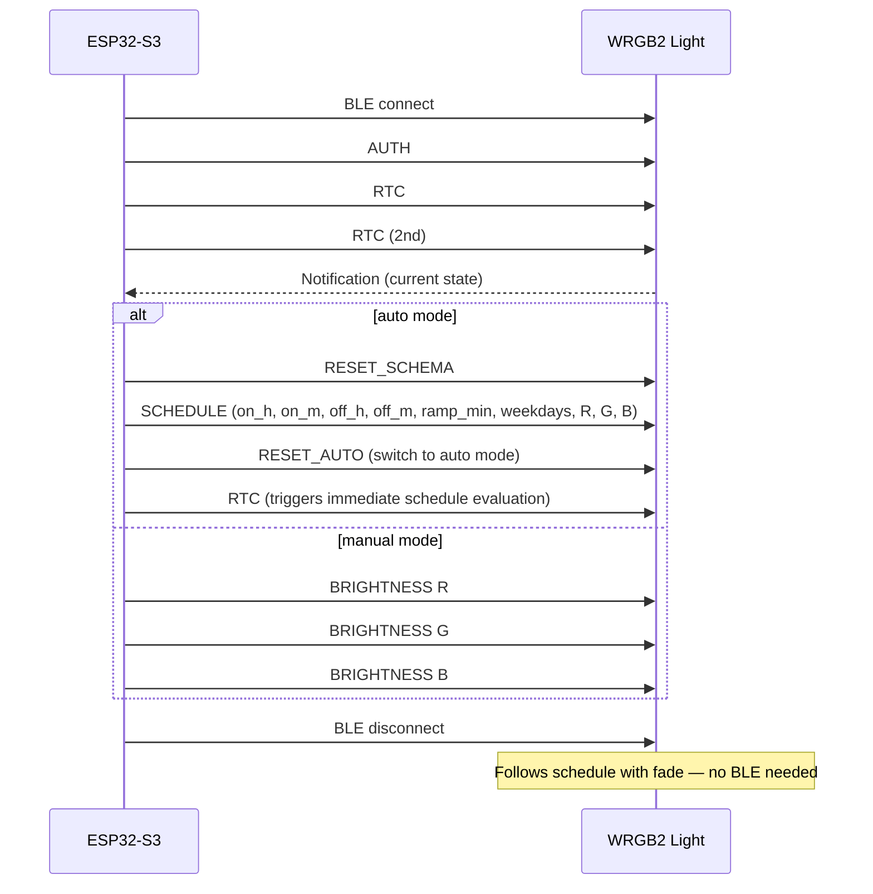
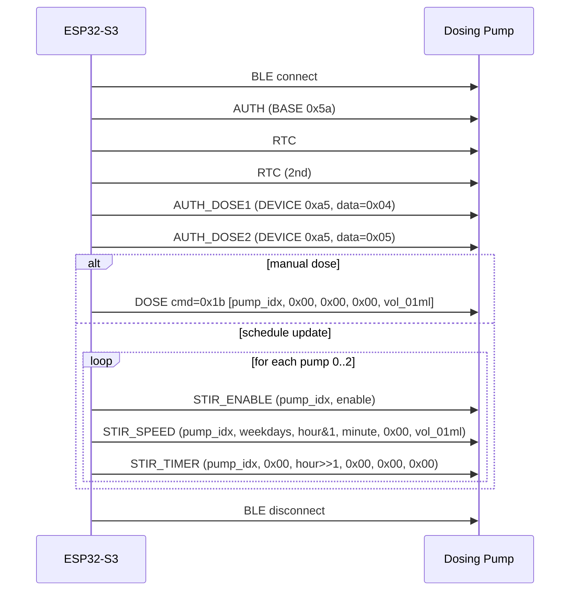
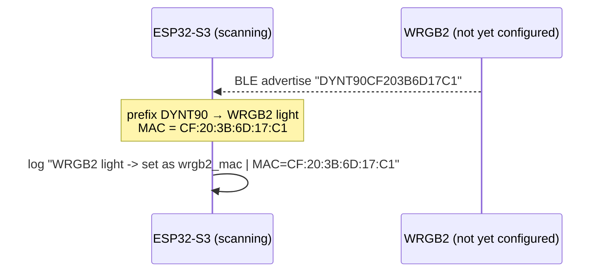

# Chihiros BLE Bridge — ESPHome

ESPHome configuration for an ESP32-S3 that controls Chihiros aquarium devices via Home Assistant, without the Chihiros app.

## How it works

Chihiros aquarium devices (CO2 controller, stirrer, fan, Doctor Mate, WRGB2 light, dosing pump) communicate via **Bluetooth Low Energy (BLE)**. Normally you control them through the Chihiros app on your phone.

This project replaces the app with an **ESP32-S3** — a small Wi-Fi + Bluetooth chip that:

1. Connects to your Chihiros devices over Bluetooth
2. Connects to your home Wi-Fi network
3. Exposes all controls to **Home Assistant** as regular entities (switches, sliders, buttons)



## Connection Architecture

All connections are **non-persistent** — the ESP32 connects to a device, sends the necessary commands, then disconnects. This is by design.

Most Chihiros devices store their configuration internally (CO2 schedules, WRGB2 light schedule, stirrer speed/timer). The ESP32 only needs to push a new schedule when something changes, not keep a permanent connection. Keeping multiple BLE connections open simultaneously competes for radio time, making every device slower to respond.



| Device | When it connects |
|---|---|
| CO2 Controller | On boot + when schedule/times change |
| WRGB2 Light | On boot + when schedule/colors change |
| Magnetic Stirrer | On boot + when a channel is toggled or settings change |
| Doctor Mate | On boot + when TDS/volume settings change |
| Cooling Fan | **Every 5 minutes** (for temperature readings) + when settings change |
| Dosing Pump | On boot + when a schedule or manual dose changes |

**Benefit**: the BLE scanner is almost always free. Toggling a stirrer channel or pushing a new CO2 schedule typically completes within 2–4 seconds.

---

## Getting Started

### What you need
- ESP32-S3-N16R8 board (or similar ESP32-S3 with 16 MB flash)
- A running Home Assistant instance with ESPHome add-on installed

### Step 1 — Fill in your secrets

Create a `secrets.yaml` in the same folder:

```yaml
wifi_ssid: "YourWiFiNetwork"
wifi_password: "YourWiFiPassword"
encryption_key: ""        # generate one in ESPHome dashboard
ota_password: "choose_a_password"
web_user: "admin"
web_password: "choose_a_password"
```

### Step 2 — Find your device MACs

Open `aquarium-ble-bridge.yaml` and replace the placeholder MACs with your actual device MACs.

**Easiest method:** flash the firmware first (Steps 3–4), then open the ESPHome logs. Any Chihiros device within BLE range that is not yet in your config will be identified automatically — no separate BLE scanner needed. See [Auto-detection](#auto-detection) below for details.

You can also find MACs via:
- The Chihiros app → device settings → device info
- A BLE scanner app (e.g. nRF Connect on Android/iOS)

> **One device per type.** This configuration assumes exactly one of each device type. If you have multiple WRGB2 lights, you would need to duplicate the package and rename all IDs.

### Step 3 — Enable the devices you want

In `aquarium-ble-bridge.yaml`, uncomment the packages you need:

```yaml
packages:
  schema:     !include aquarium-ble-bridge-schema.yaml     # fotoperiode times (shared by CO2 + WRGB2)
  co2:        !include aquarium-ble-bridge-co2.yaml
  roerder:    !include aquarium-ble-bridge-roerder.yaml
  ventilator: !include aquarium-ble-bridge-ventilator.yaml
  doctor:     !include aquarium-ble-bridge-doctor.yaml
  wrgb2:      !include aquarium-ble-bridge-wrgb2.yaml
  dosing:     !include aquarium-ble-bridge-dosing.yaml
```

`schema.yaml` defines the shared `fotoperiode_start` / `fotoperiode_eind` datetimes and the `co2_prestart` offset — used by both CO2 and WRGB2.

### Step 4 — Flash

Flash the first time via USB using the ESPHome dashboard (Web Serial in Chrome/Edge). After that, OTA works fine:

```bash
docker exec esphome esphome upload /config/aquarium-ble-bridge.yaml
```

### Step 5 — Check the logs

After booting, each device connects once, runs its init sequence, and disconnects:

```
[I][wrgb2]: Auth
[I][wrgb2]: RTC 2026-06-08 14:23:01
[I][wrgb2]: schema 08:00→22:00 ramp=30 R=61 G=45 B=80
[I][wrgb2]: init klaar, verbinding verbroken
[I][co2]: Auth
[I][co2]: CO2 schema verstuurd
[I][co2]: instellingen verstuurd, verbinding verbroken
```

This connect → configure → disconnect pattern is expected and correct.

---

## Hardware

- **Board**: ESP32-S3-N16R8 (`esp32-s3-devkitc-1`, `variant: esp32s3`, `flash_size: 16MB`)
- **Framework**: `esp-idf` (required for reliable multi-client BLE)
- **BLE connections**: up to 7 (`CONFIG_BT_ACL_CONNECTIONS: "7"`)
- **BLE scan**: `interval: 320ms`, `window: 60ms`, continuous

> **BLE 5.0 required.** Chihiros devices use BLE 5.0 extended advertising — a classic ESP32 (BLE 4.2) will not detect them at all. Use an **ESP32-S3** (or ESP32-C3/C6). The S3 is recommended for its extra RAM, which is needed when running the BLE scanner alongside multiple client connections.

## Supported Devices

| Device | Status |
|---|---|
| CO2 Controller | Working ✅ |
| Magnetic Stirrer (4-channel) | Working ✅ |
| Cooling Fan | Working ✅ |
| Doctor Mate | Working ✅ |
| WRGB II | Working ✅ |
| Dosing Pump | Working ✅ |

---

## Helper Library (`chihiros_ble.h`)

All protocol helpers are in `chihiros_ble.h`. Use these instead of raw hex.

### Headers
```cpp
chihiros::hdr::BASE   // 0x5a — auth, RTC, CO2, fan mode/speed
chihiros::hdr::DEVICE // 0xa5 — stirrer, fan threshold, Doctor Mate, WRGB2 schedule
```

### Commands
```cpp
chihiros::cmd::AUTH        // 0x04
chihiros::cmd::RTC         // 0x09
chihiros::cmd::MODE        // 0x05
chihiros::cmd::SCHEMA      // 0x16 — CO2 schedule slots
chihiros::cmd::BRIGHTNESS  // 0x07 — WRGB2 per-channel brightness
chihiros::cmd::FAN_SPEED   // 0x07 — fan manual speed
chihiros::cmd::SETTINGS    // 0x01 — Doctor Mate TDS / volume
chihiros::cmd::SCHEDULE    // 0x19 — WRGB2 auto schedule
chihiros::cmd::STIR_TOGGLE // 0x14
chihiros::cmd::STIR_TIMER  // 0x15
chihiros::cmd::STIR_SPEED  // 0x1b
chihiros::cmd::STIR_ENABLE // 0x20
chihiros::cmd::STIR_APPLY  // 0x1f
chihiros::cmd::CMD_2A      // 0x2a — stirrer persistent schema settings (lead time + speed)
chihiros::cmd::TEMP_THRESH // 0x21 — fan temperature threshold
```

### Data constants
```cpp
chihiros::data::AUTH_BASE    // 0x01
chihiros::data::AUTH_EXT1    // 0x06 — fan extra auth step 1
chihiros::data::AUTH_EXT2    // 0x08 — fan extra auth step 2
chihiros::data::RESET_SCHEMA // 0x07 — evaluate schedule now
chihiros::data::RESET_AUTO   // 0x12 — switch to auto mode
chihiros::data::SILENT_ON    // 0x22 — fan silent mode on (inverted: 0x22=ON, 0x23=OFF)
chihiros::data::SILENT_OFF   // 0x23 — fan silent mode off
chihiros::data::CO2_ON       // 0x64 — CO2 valve open
chihiros::data::CO2_OFF      // 0x00 — CO2 valve closed
chihiros::data::CO2_EMPTY    // 0x6f — schedule slot unused
chihiros::data::SKIP         // 0xff — don't touch this position
chihiros::data::WRGB_R       // 0x00 — WRGB2 red channel index
chihiros::data::WRGB_G       // 0x01 — WRGB2 green channel index
chihiros::data::WRGB_B       // 0x02 — WRGB2 blue channel index
```

### Functions
```cpp
chihiros::pakket(header, cmd, {data...}, seq)
chihiros::pakket(header, cmd, std::vector<uint8_t>, seq)
chihiros::rtc_pakket(ESPTime t, seq)
chihiros::roerder_toggle(seq, channel, on)
chihiros::stir_schema(channel, voorloop_sec, snelheid_0_20, seq)  // CMD_2A — lead time + speed on 0-20 scale
chihiros::next_seq(uint8_t& counter)   // skips 0x5a — required for WRGB2
```

> The sequence byte must never equal `0x5a` (the frame header). Use `next_seq()` for WRGB2 where the counter runs through an entire session without resetting.

---

## General Protocol

All devices use **Nordic UART Service (NUS)**:

| Role | UUID |
|---|---|
| Service | `6E400001-B5A3-F393-E0A9-E50E24DCCA9E` |
| TX (write) | `6E400002-B5A3-F393-E0A9-E50E24DCCA9E` |
| RX (notify) | `6E400003-B5A3-F393-E0A9-E50E24DCCA9E` |

Frame format:
```
[header] [0x01] [len] [0x00] [seq] [cmd] [data...] [XOR-CRC]
```

---

## CO2 Controller

> Protocol verified via btsnoop HCI analysis (2026-05-30).



`RESET_SCHEMA` clears all existing slots — no old values need to be tracked when times change.

> **Note:** The CO2 valve physically actuates (audible click) on every connect. This is normal — the controller briefly opens and then closes the valve as it evaluates the new schedule against the current time. Avoid connecting more often than necessary.

<details>
<summary>Wire examples — connect + schema (2026-06-09 14:30, fotoperiode 09:00–22:00, prestart 60 min)</summary>

```
Frame format: [header] 01 [len] 00 [seq] [cmd] [data...] [XOR-CRC]

1. auth           5a 01 06 00 01 04 01 03
2. rtc            5a 01 0b 00 02 09 1a 06 01 0e 1e 00 0c
3. rtc (2nd)      5a 01 0b 00 03 09 1a 06 01 0e 1e 00 0d
4. reset_schema   5a 01 08 00 04 05 07 ff ff 0f
5. schema ON      5a 01 08 00 05 16 08 00 64 76   08:00 CO2_ON  (0x64)
6. schema OFF     5a 01 08 00 06 16 16 00 00 0f   22:00 CO2_OFF (0x00)

Schema inactive (both slots empty):
5. schema EMPTY   5a 01 08 00 05 16 08 00 6f 19
6. schema EMPTY   5a 01 08 00 06 16 16 00 6f 06
```
</details>

---

## Magnetic Stirrer (4-channel)



Channel on/off state is stored in NVS globals (`restore_value: true`) so after an ESP reboot the stirrer returns to the last-known state.

**Parameter ranges:**

| Parameter | App label | Range | Unit | Command | Device encoding |
|---|---|---|---|---|---|
| Speed (direct) | Snelheid (direct) | 0–20 | — | `STIR_SPEED` | `speed * 127 / 20` → 0–127 |
| Duration | Duur | 1–120 | seconds | `STIR_TIMER` byte[2] | raw byte (mode 0: byte[1]=0x00) |
| Interval | Interval | 1–120 | seconds | `STIR_TIMER` byte[3] | raw byte (mode 0) |
| Lead time | Voorlooptijd | 0–255 | seconds | `CMD_2A` byte[2] | raw byte |
| Speed (schema) | Snelheid (schema) | 0–20 | — | `CMD_2A` byte[3] | raw byte |

**STIR_TIMER has two modes** (determined by byte[1]):

| byte[1] | Mode | byte[2] | byte[3] | byte[5] |
|---|---|---|---|---|
| `0x00` | Duration/interval | duration (s) | interval (s) | — |
| `0x03` | Daily clock schedule | hour (0–23) | minute (0–59) | duration (seconds) |

The Chihiros app uses mode `0x03` (clock schedule) in the Schema tab. Mode `0x00` can be used for a run-for-N-seconds-every-M-seconds pattern.

**CMD_2A** saves the lead time and speed persistently per channel (survives power cycles):

```
CMD_2A: [channel, 0x00, voorlooptijd_sec, snelheid_0-20]
```

Verified from btsnoop 2026-06-11: ch=2, voorlooptijd=36s, speed=20 → `02 00 24 14`; same channel, speed=2 → `02 00 24 02`.

STIR_TIMER mode 3 verified 2026-06-11: ch=2, start=20:33, duration=150s → `02 03 14 21 00 96`. Duration in seconds (0x5a=90s also observed).

<details>
<summary>Wire examples — connect (ch0 speed=12/20, 13s on / 30s interval) + CMD_2A + real-time toggle</summary>

```
Frame format: [header] 01 [len] 00 [seq] [cmd] [data...] [XOR-CRC]

Connect sequence:
1. auth             5a 01 06 00 01 04 01 03
2. rtc              5a 01 0b 00 02 09 1a 06 01 0e 1e 00 0c
3. stir_enable ch0  a5 01 08 00 03 20 00 00 01 2b
4. stir_speed  ch0  a5 01 0b 00 04 1b 00 4c 01 00 00 00 58   speed=76/127 (≈12/20)
5. stir_timer  ch0  a5 01 0b 00 05 15 00 00 0d 1e 00 00 01   mode 0: 13s on, 30s interval
6. stir_apply       a5 01 06 00 06 1f 00 1e
7. stir_restore     a5 01 0f 00 07 14 ff ff 01 01 01 01 ff ff ff ff 1d   all 4 channels on

CMD_2A — persistent schema settings (lead time + speed on 0-20 scale):
ch2 voorloop=36s speed=20  a5 01 09 00 08 2a 02 00 24 14 0d
ch2 voorloop=36s speed=2   a5 01 09 00 09 2a 02 00 24 02 1b
                                              ^^ channel (0-indexed)
                                                    ^^ voorlooptijd (seconds)
                                                       ^^ snelheid (0-20 app scale)

Real-time toggle (STIR_TOGGLE — only target channel, rest 0xff = SKIP):
toggle ch0 ON   a5 01 0f 00 01 14 ff ff 01 ff ff ff ff ff ff ff e5
toggle ch0 OFF  a5 01 0f 00 01 14 ff ff 00 ff ff ff ff ff ff ff e4
                                         ^^ byte[2+channel]
```
</details>

---

## Cooling Fan



Notifications (`x[4] == 0x01`):

| Byte | Value |
|---|---|
| `x[5]` | Fan speed (%) |
| `x[6:7] / 256` | Room temperature (°C) |
| `x[11] / 10` | Water temperature (°C) |
| `x[12]` | Humidity (%) |

<details>
<summary>Wire examples — connect (silent on, 28–32°C) + notification decode</summary>

```
Frame format: [header] 01 [len] 00 [seq] [cmd] [data...] [XOR-CRC]

Connect sequence:
1. auth        5a 01 06 00 01 04 01 03
2. rtc         5a 01 0b 00 02 09 1a 06 01 0e 1e 00 0c
3. rtc (2nd)   5a 01 0b 00 03 09 1a 06 01 0e 1e 00 0d
4. auth_ext1   a5 01 06 00 04 04 06 01
5. auth_ext2   a5 01 06 00 05 04 08 0e
6. silent ON   5a 01 08 00 06 05 22 ff ff 28   (0x22=ON, 0x23=OFF — inverted!)
7. temp_thresh a5 01 08 00 07 21 1c 20 ff ec   28°C start, 32°C max
8. fan_speed   5a 01 07 00 08 07 ff 00 f6       0 = auto

Notification (x[4] == 0x01):
00 00 00 00 01 2d 18 80 00 00 00 fa 3e
                  ^^                        x[5]    = 45  → fan 45%
                     ^^ ^^                  x[6:7]  = 0x1880 → 24.5°C room
                                 ^^         x[11]   = 250 → 25.0°C water
                                    ^^      x[12]   = 62  → 62% humidity
```
</details>

---

## Doctor Mate



TDS and Volume use **identical frames** — device distinguishes them **only by send order**. Always send both in this order.

Encoding: EC (µS/cm) = ppm ÷ 0.4. Volume = liters × 2.

<details>
<summary>Wire examples — connect (EC=100 µS/cm, volume=100 L)</summary>

```
Frame format: [header] 01 [len] 00 [seq] [cmd] [data...] [XOR-CRC]

1. auth_device    a5 01 06 00 01 04 01 03   (DEVICE header 0xa5)
2. rtc            5a 01 0b 00 02 09 1a 06 01 0e 1e 00 0c
3. settings TDS   a5 01 07 00 03 01 00 64 60   b2=0x64 (100 µS/cm), pos1
4. settings VOL   a5 01 07 00 04 01 00 c8 cb   b2=0xc8 (200 = 100 L × 2), pos2

Frames 3 and 4 are byte-identical except b2 — order determines meaning.
```
</details>

---

## WRGB II

> Protocol verified via btsnoop HCI analysis (2026-05-30).



Schedule data: `[on_h, on_m, off_h, off_m, ramp_min, weekdays, R, G, B, 0xff×5]`

- `ramp_min`: fade duration 0–150 min. **Value 90 is forbidden** (= 0x5a frame header) → use 89.
- `weekdays`: bitmask — each bit is one day:

  | Dag / Day | Dec |  Hex |
  |-----------|----:|-----:|
  | Ma / Mon  |  64 | 0x40 |
  | Di / Tue  |  32 | 0x20 |
  | Wo / Wed  |  16 | 0x10 |
  | Do / Thu  |   8 | 0x08 |
  | Vr / Fri  |   4 | 0x04 |
  | Za / Sat  |   2 | 0x02 |
  | Zo / Sun  |   1 | 0x01 |

  Common values: every day = 127 (0x7f) · workdays (Ma–Vr) = 124 (0x7c) · weekend = 3 (0x03) · Mon+Wed+Thu = 88 (0x58)
- `R/G/B = 0xff` = delete marker (deactivate schedule).

<details>
<summary>Wire examples — auto schedule (09:00–22:00, ramp 30 min, R=61 G=45 B=80) + manual brightness</summary>

```
Frame format: [header] 01 [len] 00 [seq] [cmd] [data...] [XOR-CRC]
Note: seq must never be 0x5a — use next_seq() which skips value 90.

Auto schedule:
1. rtc            5a 01 0b 00 01 09 1a 06 01 0e 1e 00 0f
2. rtc (2nd)      5a 01 0b 00 02 09 1a 06 01 0e 1e 00 0c
3. reset_schema   5a 01 08 00 03 05 07 ff ff 08
4. wrgb_schedule  a5 01 13 00 04 19 09 00 16 00 1e 7f 3d 2d 50 ff ff ff ff ff ce
                                          ^^ ^^             ^^                      on  09:00
                                                ^^ ^^                               off 22:00
                                                      ^^                            ramp 30 min
                                                         ^^                         weekdays 0x7f = every day
                                                            ^^ ^^ ^^                R=61 G=45 B=80
5. reset_auto     5a 01 08 00 05 05 12 ff ff 1b
6. rtc (trigger)  5a 01 0b 00 06 09 1a 06 01 0e 1e 00 08

Manual brightness (R=80, G=60, B=100):
1. wrgb_ch R      5a 01 07 00 01 07 00 50 50   channel=0x00
2. wrgb_ch G      5a 01 07 00 02 07 01 3c 3e   channel=0x01
3. wrgb_ch B      5a 01 07 00 03 07 02 64 64   channel=0x02
```
</details>

---

## Dosing Pump

> Protocol verified via btsnoop HCI analysis (2026-06-08).



Supports 4 pumps (0-indexed). Volume in 0.1 mL units. Hour is split across two frames: `TIMER[2] = hour >> 1`, `SPEED[2] = hour & 1`.

Weekdays bitmask — each bit is one day (same encoding as WRGB2):

| Dag / Day | Dec |  Hex |
|-----------|----:|-----:|
| Ma / Mon  |  64 | 0x40 |
| Di / Tue  |  32 | 0x20 |
| Wo / Wed  |  16 | 0x10 |
| Do / Thu  |   8 | 0x08 |
| Vr / Fri  |   4 | 0x04 |
| Za / Sat  |   2 | 0x02 |
| Zo / Sun  |   1 | 0x01 |

Common values: every day = 127 (0x7f) · workdays (Ma–Vr) = 124 (0x7c) · weekend = 3 (0x03) · Mon+Wed+Thu = 88 (0x58)

Manual dose triggers immediately; schedule runs autonomously on the pump's internal RTC.

<details>
<summary>Wire examples — connect + manual dose 2.0 mL + schedule pump 1 every day 09:00 1.5 mL</summary>

```
Frame format: [header] 01 [len] 00 [seq] [cmd] [data...] [XOR-CRC]

Connect sequence:
1. auth        5a 01 06 00 01 04 01 03
2. rtc         5a 01 0b 00 02 09 1a 06 01 0e 1e 00 0c
3. rtc (2nd)   5a 01 0b 00 03 09 1a 06 01 0e 1e 00 0d
4. auth_dose1  a5 01 06 00 04 04 04 03
5. auth_dose2  a5 01 06 00 05 04 05 03

Manual dose pump 1 (pump_idx=0x00), 2.0 mL (vol_01ml=20=0x14):
   dose_pump    a5 01 0a 00 06 1b 00 00 00 00 14 02

Schedule pump 1, every day (0x7f), 09:00, 1.5 mL (vol=15=0x0f):
   hour=9 → TIMER[2]=hour>>1=4, SPEED[2]=hour&1=1
   schedule_enable  a5 01 08 00 06 20 00 00 01 2e
   schedule_speed   a5 01 0b 00 07 1b 00 7f 01 00 00 0f 67
                                         ^^                  pump_idx=0
                                            ^^               weekdays=0x7f (all)
                                               ^^            hour & 1 = 1
                                                  ^^         minute=0
                                                        ^^   vol=15 (1.5 mL)
   schedule_timer   a5 01 0b 00 08 15 00 00 04 00 00 00 13
                                         ^^                  pump_idx=0
                                               ^^            hour >> 1 = 4
```
</details>

---

## Auto-detection

Every Chihiros device advertises a BLE name in the format `DY{type}{MAC}` — the type prefix is encoded directly in the name. The firmware uses this to automatically identify any Chihiros device within range that is not yet in your configuration:

```
[I][ble_scan]: Chihiros found: WRGB2 light         -> set as wrgb2_mac | MAC=CF:20:3B:6D:17:C1 RSSI=-62
[I][ble_scan]: Chihiros found: CO2 controller      -> set as co2_mac   | MAC=CC:A0:27:8E:79:E9 RSSI=-58
[I][ble_scan]: Chihiros found: Magnetic stirrer    -> set as roerder_mac | MAC=D3:A1:88:0F:7C:42 RSSI=-71
```



Known prefixes:

| BLE name prefix | Device type | Substitution variable |
|---|---|---|
| `DYNT90` | WRGB2 light | `wrgb2_mac` |
| `DYPCO2` | CO2 controller | `co2_mac` |
| `DYMIX` | Magnetic stirrer | `roerder_mac` |
| `DYNFAN` | Cooling fan | `ventilator_mac` |
| `DYNDOC` | Doctor Mate | `doctor_mac` |
| `DYDOSE` | Dosing pump | `dosing_mac` |

Devices already present in your substitutions are silently ignored — only unconfigured devices are logged. Once you have all MACs, fill them in and reflash.

---

## ESPHome Tips

- State persistence across reboots: use `globals` with `restore_value: true`. The lambda `return id(my_global)` reflects current state even after a crash/reboot.
- `script.execute` with inline `{ }` parameter syntax is unreliable from `turn_on/turn_off_action`. Use inline `ble_client.ble_write` instead.
- Secrets required: `wifi_ssid`, `wifi_password`, `encryption_key`, `ota_password`, `web_user`, `web_password`.
